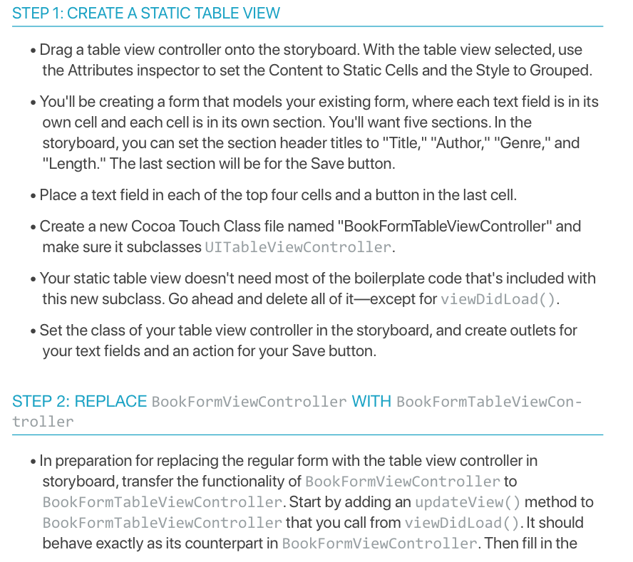

# CIS-444
## Lecture 23: Intermediate Table Views

* ✏️ Complete and submit to `RCSlatki@syr.edu` by the next class (`Wednesday, April 15, 2020`)

Table views are one of the most common views in iOS, and you'll use them in nearly every app you build. In the previous lesson, you learned the basics of setting up a table view to display a list of information.
In this lesson, you'll learn how to further customize your table views with custom cells, how to dynamically insert and remove cells, how to use static table views to present forms or other non-changing lists, and how to allow the user to swipe to delete cells.

### What You'll Learn
* How to create custom-designed cells
* How to add and delete rows from a table view
* How to use a static table view
* How to add custom row actions

In the previous lesson, you learned how to build basic table views. While the styles and functionality provided by basic table views gets you far, you'll often find you want more customization. In this lesson, you'll learn how to create custom table view cells and use row actions to add and delete table view rows. You'll also learn how you can use table views to display static data without the overhead of implementing the table view's data source.

